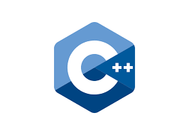

# 212 ADVANCED DATA STRUCTURES

**3.0 Units**

 CS/IS 212 is designed to provide a thorough coverage of data structures with data abstraction applied to a broad spectrum of practical applications. Students who take this course master the principles of programming as a tool for problem solving. Students solve practical problems in a computer-equipped laboratory using an object oriented programming language, such as JAVA. Some specific topics covered include hash tables, trees, persistent structures, indexed files, and databases. Lecture 3 hours. 

**Prerequisite:** CS/IS 211 or equivalent.

**Course Typically Offered:** Spring (Every Other Year).

**Transfer Credit:** CSU, UC, USC.

---
